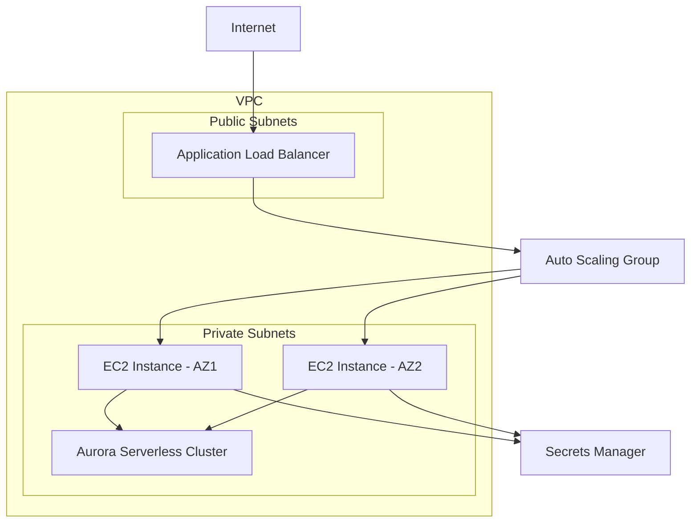

# Design Document

## Overview

This design outlines a re-architected PHP application infrastructure on AWS that provides secure, scalable, and cost-efficient data ingestion and processing capabilities. The architecture leverages AWS managed services including Aurora Serverless, EC2 Auto Scaling, Application Load Balancer, and implements security best practices with private subnets and Secrets Manager.

## Architecture

### High-Level Architecture



### Network Architecture

- **VPC**: Custom VPC spanning multiple AZs (us-east-1a, us-east-1b)
- **Public Subnets**: Host ALB for internet-facing traffic
- **Private Subnets**: Host EC2 instances and Aurora Serverless cluster
- **Internet Gateway**: Provides internet access to public subnets
- **NAT Gateway**: Enables outbound internet access for private subnets
- **Route Tables**: Separate routing for public and private subnets

## Components and Interfaces

### 1. Application Load Balancer (ALB)
- **Purpose**: Distributes incoming traffic across EC2 instances
- **Configuration**: 
  - Internet-facing scheme
  - HTTP/HTTPS listeners (port 80/443)
  - SSL termination with ACM certificates
  - Health checks on `/health` endpoint
- **Target Groups**: EC2 instances in Auto Scaling Group
- **Security**: Security Group allowing HTTP/HTTPS from internet

### 2. Auto Scaling Group (ASG)
- **Purpose**: Manages EC2 instance lifecycle and scaling
- **Configuration**:
  - Min: 2 instances, Max: 10 instances, Desired: 2
  - Launch Template with PHP application AMI
  - Multi-AZ deployment for high availability
  - CloudWatch-based scaling policies
- **Scaling Triggers**:
  - CPU utilization > 80% (scale out)
  - CPU utilization < 30% (scale in)
  - Custom application metrics

### 3. EC2 Instances
- **Instance Type**: t3.medium (burstable performance)
- **AMI**: Custom AMI with PHP 8.1, Nginx, and application code
- **User Data**: Bootstrap script for application configuration
- **IAM Role**: Permissions for Secrets Manager, CloudWatch, and Aurora
- **Security Group**: Allow traffic from ALB only

### 4. Aurora Serverless v2 Cluster
- **Engine**: MySQL 8.0 compatible
- **Configuration**:
  - Multi-AZ deployment
  - Automatic backup enabled (7-day retention)
  - Encryption at rest enabled
  - Performance Insights enabled
- **Scaling**: 0.5 - 16 ACUs (Aurora Capacity Units)
- **Security**: VPC Security Group allowing access from EC2 instances only

### 5. Secrets Manager
- **Purpose**: Store database credentials and API keys
- **Secrets**:
  - Aurora master credentials
  - Application API keys
  - Third-party service credentials
- **Rotation**: Automatic rotation enabled for database credentials
- **Access**: IAM-based access control

### 6. Security Groups
- **ALB Security Group**:
  - Inbound: HTTP (80), HTTPS (443) from 0.0.0.0/0
  - Outbound: All traffic to EC2 Security Group
- **EC2 Security Group**:
  - Inbound: HTTP (80) from ALB Security Group
  - Outbound: HTTPS (443) to internet, MySQL (3306) to Aurora
- **Aurora Security Group**:
  - Inbound: MySQL (3306) from EC2 Security Group
  - Outbound: None

## Data Models

### Database Schema
```sql
-- Users table for application authentication
CREATE TABLE users (
    id INT PRIMARY KEY AUTO_INCREMENT,
    username VARCHAR(50) UNIQUE NOT NULL,
    email VARCHAR(100) UNIQUE NOT NULL,
    password_hash VARCHAR(255) NOT NULL,
    created_at TIMESTAMP DEFAULT CURRENT_TIMESTAMP,
    updated_at TIMESTAMP DEFAULT CURRENT_TIMESTAMP ON UPDATE CURRENT_TIMESTAMP
);

-- Data ingestion jobs tracking
CREATE TABLE ingestion_jobs (
    id INT PRIMARY KEY AUTO_INCREMENT,
    job_name VARCHAR(100) NOT NULL,
    status ENUM('pending', 'running', 'completed', 'failed') DEFAULT 'pending',
    source_type VARCHAR(50) NOT NULL,
    records_processed INT DEFAULT 0,
    error_message TEXT,
    started_at TIMESTAMP NULL,
    completed_at TIMESTAMP NULL,
    created_at TIMESTAMP DEFAULT CURRENT_TIMESTAMP
);

-- Processed data storage
CREATE TABLE processed_data (
    id INT PRIMARY KEY AUTO_INCREMENT,
    job_id INT,
    data_type VARCHAR(50) NOT NULL,
    raw_data JSON,
    processed_data JSON,
    processing_time_ms INT,
    created_at TIMESTAMP DEFAULT CURRENT_TIMESTAMP,
    FOREIGN KEY (job_id) REFERENCES ingestion_jobs(id)
);
```

### Application Configuration
```php
// Database connection configuration
$config = [
    'database' => [
        'host' => getenv('DB_HOST'),
        'port' => getenv('DB_PORT') ?: 3306,
        'database' => getenv('DB_NAME'),
        'username' => getSecretValue('aurora-credentials', 'username'),
        'password' => getSecretValue('aurora-credentials', 'password'),
        'charset' => 'utf8mb4',
        'options' => [
            PDO::ATTR_ERRMODE => PDO::ERRMODE_EXCEPTION,
            PDO::ATTR_DEFAULT_FETCH_MODE => PDO::FETCH_ASSOC,
            PDO::ATTR_EMULATE_PREPARES => false,
        ]
    ]
];
```

## Error Handling

### Application Level
- **Database Connection Failures**: Retry with exponential backoff, fallback to read replicas
- **API Errors**: Structured error responses with appropriate HTTP status codes
- **Data Processing Errors**: Log errors, update job status, send notifications
- **Memory/Resource Limits**: Graceful degradation and error logging

### Infrastructure Level
- **Instance Failures**: Auto Scaling Group automatically replaces failed instances
- **AZ Failures**: Multi-AZ deployment ensures continued operation
- **Database Failures**: Aurora Serverless automatic failover
- **Load Balancer Health Checks**: Automatic traffic routing away from unhealthy instances

### Monitoring and Alerting
- **CloudWatch Metrics**: Custom application metrics and AWS service metrics
- **CloudWatch Alarms**: CPU utilization, memory usage, database connections
- **SNS Notifications**: Alert administrators of critical failures
- **Application Logs**: Centralized logging with CloudWatch Logs

## Testing Strategy

### Unit Testing
- **PHP Unit Tests**: Test individual functions and classes
- **Database Layer Tests**: Test data access objects and repositories
- **API Endpoint Tests**: Test REST API responses and error handling
- **Configuration Tests**: Validate environment-specific configurations

### Integration Testing
- **Database Integration**: Test Aurora Serverless connectivity and queries
- **Secrets Manager Integration**: Test credential retrieval and rotation
- **Load Balancer Integration**: Test health check endpoints
- **Auto Scaling Integration**: Test scaling triggers and instance lifecycle

### Infrastructure Testing
- **Terraform Validation**: Validate infrastructure as code syntax
- **Security Group Testing**: Verify network access controls
- **Multi-AZ Testing**: Test failover scenarios
- **Performance Testing**: Load testing with realistic traffic patterns

### Deployment Testing
- **Blue-Green Deployment**: Test zero-downtime deployments
- **Rollback Testing**: Verify ability to rollback failed deployments
- **Configuration Management**: Test environment-specific configurations
- **Health Check Validation**: Ensure proper health check responses

## Security Considerations

### Network Security
- Private subnets for application and database tiers
- Security Groups with least privilege access
- NACLs for additional network-level security
- VPC Flow Logs for network monitoring

### Data Security
- Encryption at rest for Aurora Serverless
- Encryption in transit for all communications
- Secrets Manager for credential management
- IAM roles with minimal required permissions

### Application Security
- Input validation and sanitization
- SQL injection prevention with prepared statements
- HTTPS enforcement with SSL/TLS termination
- Security headers implementation