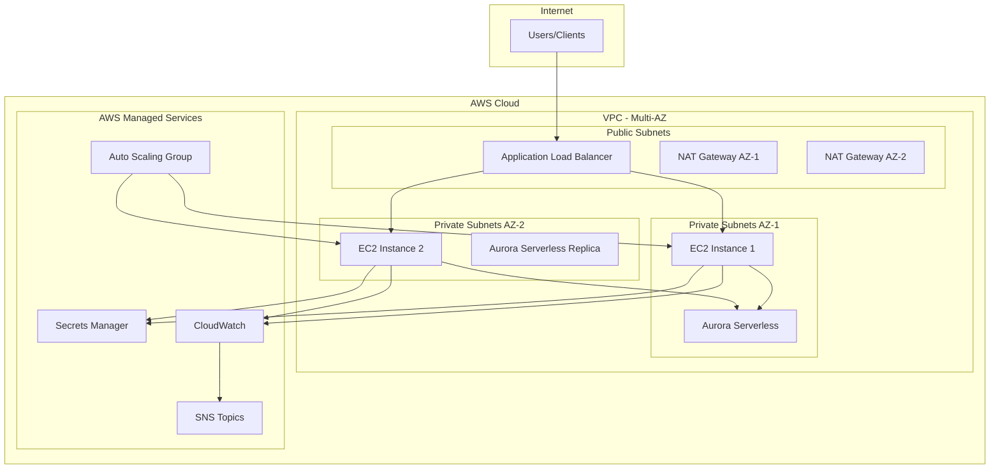

# Architecture Documentation

## Overview

The AWS PHP Data Platform is designed as a secure, scalable, and cost-efficient infrastructure for PHP-based applications with automated data ingestion and processing capabilities.

## High-Level Architecture



## Component Details

### 1. Network Layer

#### VPC (Virtual Private Cloud)
- **CIDR**: 10.0.0.0/16
- **Multi-AZ**: Spans 2 Availability Zones for high availability
- **DNS**: Enabled for hostname resolution

#### Subnets
- **Public Subnets**: 
  - 10.0.1.0/24 (AZ-1), 10.0.2.0/24 (AZ-2)
  - Host ALB and NAT Gateways
  - Internet Gateway routing
  
- **Private Subnets**: 
  - 10.0.11.0/24 (AZ-1), 10.0.12.0/24 (AZ-2)
  - Host EC2 instances and Aurora cluster
  - NAT Gateway routing for outbound internet access

#### Routing
- **Public Route Table**: Routes to Internet Gateway
- **Private Route Tables**: Routes to NAT Gateways (one per AZ)

### 2. Load Balancing Layer

#### Application Load Balancer (ALB)
- **Scheme**: Internet-facing
- **Listeners**: HTTP (80) and HTTPS (443)
- **SSL Termination**: AWS Certificate Manager integration
- **Health Checks**: `/health` endpoint with 30-second intervals
- **Sticky Sessions**: Configurable based on application needs

#### Target Groups
- **Protocol**: HTTP on port 80
- **Health Check Path**: `/health`
- **Healthy Threshold**: 2 consecutive successful checks
- **Unhealthy Threshold**: 3 consecutive failed checks

### 3. Compute Layer

#### EC2 Instances
- **Instance Type**: t3.medium (2 vCPU, 4 GiB RAM)
- **AMI**: Custom AMI with PHP 8.1, Nginx, and application code
- **Storage**: 20 GB GP3 EBS volumes
- **User Data**: Bootstrap script for application configuration

#### Auto Scaling Group
- **Min Size**: 2 instances
- **Max Size**: 10 instances
- **Desired Capacity**: 2 instances
- **Health Check Type**: ELB + EC2
- **Health Check Grace Period**: 300 seconds

#### Scaling Policies
- **Scale Out**: CPU > 80% for 2 consecutive 5-minute periods
- **Scale In**: CPU < 30% for 5 consecutive 5-minute periods
- **Cooldown**: 300 seconds between scaling activities

### 4. Database Layer

#### Aurora Serverless v2
- **Engine**: MySQL 8.0 compatible
- **Capacity**: 0.5 - 16 ACUs (Aurora Capacity Units)
- **Multi-AZ**: Automatic failover enabled
- **Backup**: 7-day retention with point-in-time recovery
- **Encryption**: At-rest encryption enabled
- **Performance Insights**: Enabled for query analysis

#### Database Configuration
- **Parameter Group**: Custom parameter group for optimization
- **Subnet Group**: Spans private subnets in both AZs
- **Security Group**: Allows access only from EC2 instances

### 5. Security Layer

#### Security Groups

**ALB Security Group**
```
Inbound:
- HTTP (80) from 0.0.0.0/0
- HTTPS (443) from 0.0.0.0/0

Outbound:
- HTTP (80) to EC2 Security Group
```

**EC2 Security Group**
```
Inbound:
- HTTP (80) from ALB Security Group
- SSH (22) from Bastion Host (optional)

Outbound:
- HTTPS (443) to 0.0.0.0/0 (for package updates)
- MySQL (3306) to Aurora Security Group
```

**Aurora Security Group**
```
Inbound:
- MySQL (3306) from EC2 Security Group

Outbound:
- None (default deny)
```

#### IAM Roles and Policies

**EC2 Instance Role**
- SecretsManager read access for database credentials
- CloudWatch logs and metrics write access
- S3 access for application assets (if needed)

**Aurora Role**
- CloudWatch monitoring permissions
- Enhanced monitoring permissions

### 6. Secrets Management

#### AWS Secrets Manager
- **Aurora Credentials**: Master username and password
- **API Keys**: Third-party service credentials
- **Automatic Rotation**: Enabled for database credentials
- **Encryption**: KMS encryption with customer-managed keys

### 7. Monitoring and Logging

#### CloudWatch Metrics
- **EC2 Metrics**: CPU, Memory, Disk, Network
- **Aurora Metrics**: Connections, CPU, Read/Write IOPS
- **ALB Metrics**: Request count, Response time, Error rates
- **Custom Metrics**: Application-specific metrics

#### CloudWatch Alarms
- **High CPU**: Triggers auto-scaling
- **Database Connections**: Alerts when approaching limits
- **Application Errors**: Alerts on high error rates
- **Cost Thresholds**: Budget alerts

#### Logging
- **Application Logs**: CloudWatch Logs group `/aws/ec2/php-app`
- **Web Server Logs**: Nginx access and error logs
- **System Logs**: EC2 system logs
- **VPC Flow Logs**: Network traffic monitoring

### 8. Data Flow

#### Request Flow
1. User request hits ALB
2. ALB performs health check and routes to healthy EC2 instance
3. Nginx receives request and forwards to PHP application
4. PHP application processes request
5. Database queries sent to Aurora Serverless
6. Response returned through the same path

#### Data Ingestion Flow
1. Data ingestion API endpoint receives data
2. Data validation and preprocessing
3. Job record created in database
4. Data processing workflow initiated
5. Processed data stored in database
6. Job status updated
7. Metrics and logs sent to CloudWatch

## Scalability Patterns

### Horizontal Scaling
- **Auto Scaling Group**: Automatically adds/removes EC2 instances
- **Aurora Serverless**: Automatically scales database capacity
- **Load Balancer**: Distributes traffic across available instances

### Vertical Scaling
- **Instance Types**: Can be upgraded to larger instance types
- **Aurora ACUs**: Can be increased for more database capacity
- **EBS Volumes**: Can be expanded for more storage

### Geographic Scaling
- **Multi-AZ**: Built-in high availability
- **Multi-Region**: Can be extended for global deployment
- **CloudFront**: CDN integration for global content delivery

## Security Architecture

### Defense in Depth
1. **Network Level**: VPC, Security Groups, NACLs
2. **Instance Level**: IAM roles, Security Groups
3. **Application Level**: Input validation, authentication
4. **Data Level**: Encryption at rest and in transit

### Compliance Considerations
- **Data Encryption**: All data encrypted using AWS KMS
- **Access Logging**: All API calls logged via CloudTrail
- **Network Monitoring**: VPC Flow Logs enabled
- **Secrets Management**: No hardcoded credentials

## Disaster Recovery

### Backup Strategy
- **Database**: Automated backups with 7-day retention
- **Application**: Code stored in Git with CI/CD pipeline
- **Infrastructure**: Terraform state with versioning
- **Configuration**: Environment files backed up securely

### Recovery Procedures
- **RTO (Recovery Time Objective)**: < 1 hour
- **RPO (Recovery Point Objective)**: < 15 minutes
- **Multi-AZ Failover**: Automatic within 60 seconds
- **Cross-Region Recovery**: Manual process with documented procedures

## Performance Optimization

### Database Optimization
- **Connection Pooling**: Reduces connection overhead
- **Query Optimization**: Proper indexing and query structure
- **Read Replicas**: Can be added for read-heavy workloads
- **Caching**: Application-level caching with Redis (future enhancement)

### Application Optimization
- **PHP OPcache**: Bytecode caching enabled
- **Nginx Optimization**: Proper worker configuration
- **Static Content**: Served directly by Nginx
- **Compression**: Gzip compression enabled

### Infrastructure Optimization
- **Instance Types**: Right-sized based on workload
- **EBS Optimization**: GP3 volumes with appropriate IOPS
- **Network Optimization**: Enhanced networking enabled
- **Placement Groups**: For low-latency requirements (if needed)

## Cost Optimization

### Aurora Serverless Benefits
- **Pay-per-use**: Only pay for actual database usage
- **Automatic Scaling**: Scales down during idle periods
- **No Idle Costs**: Pauses when not in use (configurable)

### Auto Scaling Benefits
- **Dynamic Sizing**: Matches capacity to demand
- **Cost Control**: Prevents over-provisioning
- **Spot Instances**: Can be integrated for additional savings

### Monitoring and Optimization
- **Cost Explorer**: Regular cost analysis
- **Trusted Advisor**: AWS recommendations
- **Resource Tagging**: Detailed cost allocation
- **Budget Alerts**: Proactive cost management

## Future Enhancements

### Containerization
- **ECS/EKS**: Container orchestration
- **Docker**: Application containerization
- **Service Mesh**: Advanced networking and security

### Advanced Monitoring
- **X-Ray**: Distributed tracing
- **Custom Dashboards**: Business-specific metrics
- **Anomaly Detection**: ML-powered monitoring

### Additional Services
- **ElastiCache**: Redis caching layer
- **SQS/SNS**: Message queuing and notifications
- **Lambda**: Serverless processing functions
- **API Gateway**: API management and throttling

### Multi-Region Deployment
- **Cross-Region Replication**: Database replication
- **Global Load Balancer**: Route 53 health checks
- **CDN Integration**: CloudFront for global content delivery